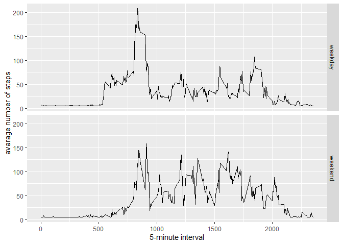

##Loading the Required Packages:


## Q1) Loading and preprocessing the data

#1a) Read data

```r
if(!file.exists('activity.csv')){
    unzip('activity.zip')
}
activityInfo <- read.csv('activity.csv')
```

#1b)

```r
#activityInfo$interval <- strptime(gsub("([0-9]{1,2})([0-9]{2})", "\\1:\\2", activityInfo$interval), format='%H:%M')
```

-----

##Q2) What is mean total number of steps taken per day?

#2a) Calculate total steps per day

```r
stepsPerDay <- tapply(activityInfo$steps, activityInfo$date, sum, na.rm=TRUE)
```

#2b) Plot histogram of mean steps per day

```r
qplot(stepsPerDay, xlab='Total steps per day', ylab='Frequency using binwith 500', binwidth=500)
```

<!-- -->

#2c)

```r
stepsPerDayMean <- mean(stepsPerDay)
stepsPerDayMedian <- median(stepsPerDay)
```

##Q3) What is the average daily activity pattern?

#3a) Make a time series plot showing the average daily activity pattern

```r
averageStepsPerTimeBlock <- aggregate(x=list(meanSteps=activityInfo$steps), by=list(interval=activityInfo$interval), FUN=mean, na.rm=TRUE)
```

```r
ggplot(data=averageStepsPerTimeBlock, aes(x=interval, y=meanSteps)) +
    geom_line() +
    xlab("5-minute interval") +
    ylab("average number of steps taken") 
```

<!-- -->

#3b)


```r
mostSteps <- which.max(averageStepsPerTimeBlock$meanSteps)
timeMostSteps <-  gsub("([0-9]{1,2})([0-9]{2})", "\\1:\\2", averageStepsPerTimeBlock[mostSteps,'interval'])
```
* Most Steps at: 8:35

----

##Q4) Imputing missing values

#4a) Number of observations with NA values 

```r
numMissingValues <- length(which(is.na(activityInfo$steps)))
```

* Number of missing values: 2304

#4b) Create a new dataset that is equal to the original dataset but with the missing data filled in.

```r
activityInfoImputed <- activityInfo
activityInfoImputed$steps <- impute(activityInfo$steps, fun=mean)
```
    
#4c) Make a histogram of the total number of steps taken each day (with missing values subbed in)

```r
stepsPerDayImputed <- tapply(activityInfoImputed$steps, activityInfoImputed$date, sum)
qplot(stepsPerDayImputed, xlab='Total steps per day (Imputed)', ylab='Frequency using binwith 500', binwidth=500)
```

<!-- -->


```r
stepsPerDayMeanImputed <- mean(stepsPerDayImputed)
stepsPerDayMedianImputed <- median(stepsPerDayImputed)
```
* Mean (Imputed): 1.0766189\times 10^{4}
* Median (Imputed):  1.0766189\times 10^{4}


----


##Q5) Are there differences in activity patterns between weekdays and weekends?

#5a)

```r
activityInfoImputed$dateType <-  ifelse(as.POSIXlt(activityInfoImputed$date)$wday %in% c(0,6), 'weekend', 'weekday')
```


#5b)

```r
averagedactivityInfoImputed <- aggregate(steps ~ interval + dateType, data=activityInfoImputed, mean)
ggplot(averagedactivityInfoImputed, aes(interval, steps)) + 
    geom_line() + 
    facet_grid(dateType ~ .) +
    xlab("5-minute interval") + 
    ylab("avarage number of steps")
```

<!-- -->
    
    
    
